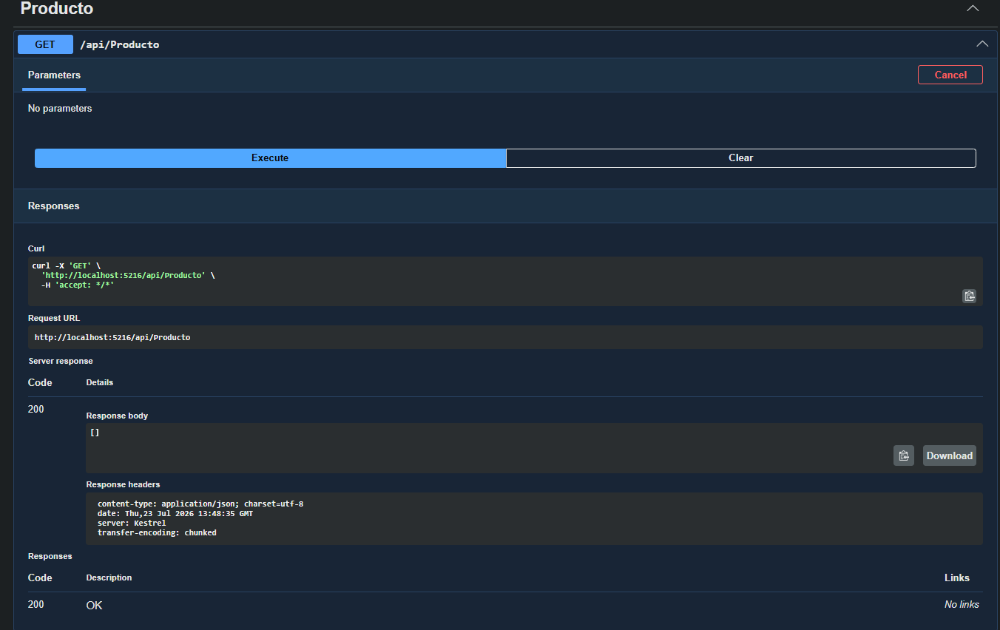
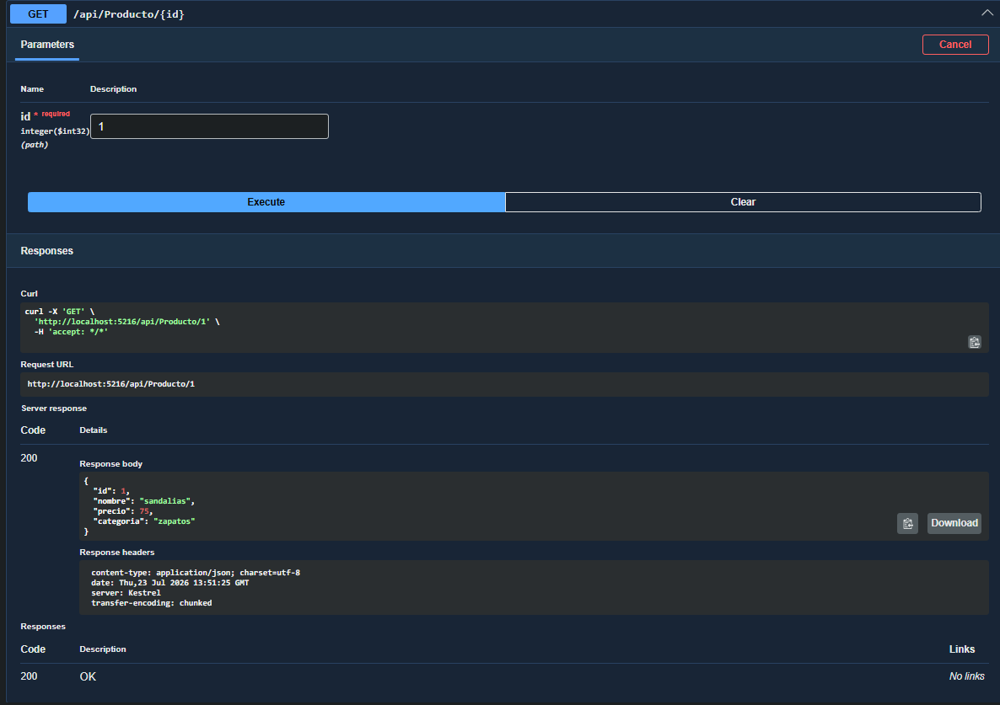
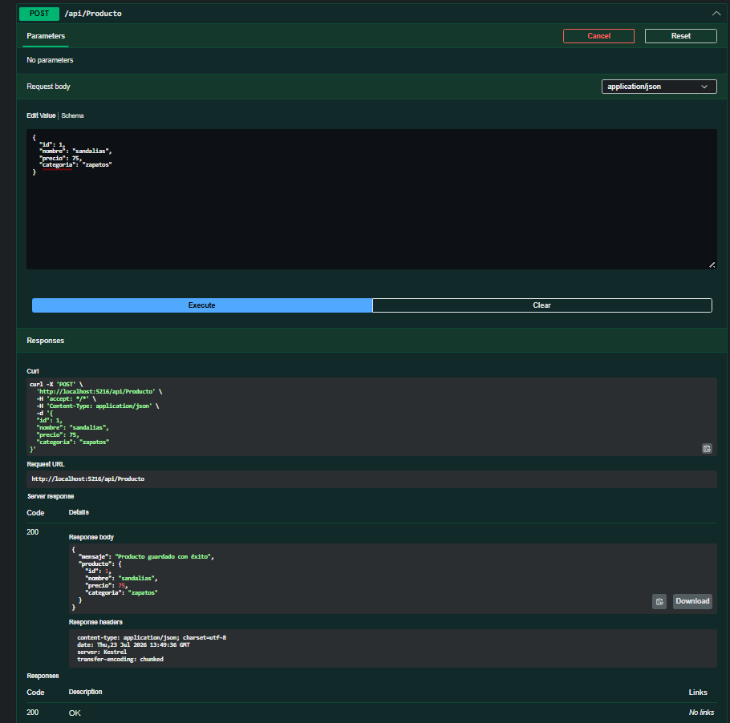
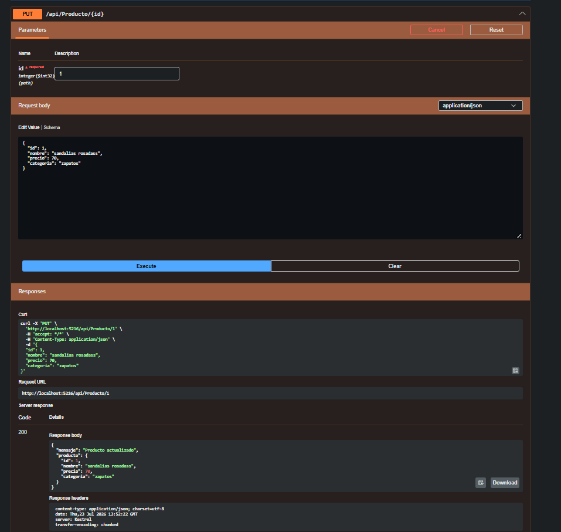
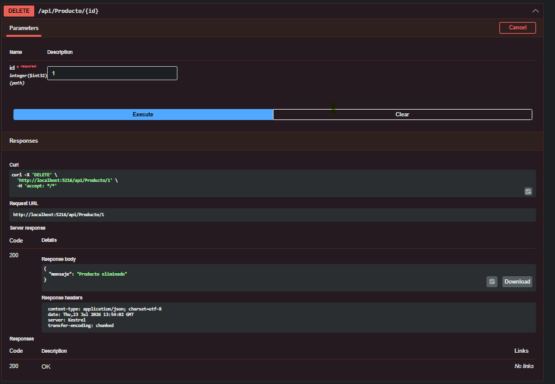
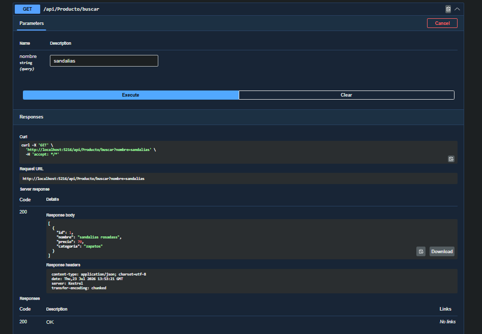

# Proyecto Segundo Parcial - Backend API

Proyecto desarrollado con ASP.NET Core Web API y Entity Framework Core para la gestión de productos.

## Evidencias de Pruebas (Swagger)

A continuación se presentan las capturas de pantalla que demuestran el funcionamiento de los endpoints:

### 1. GET Productos

### 2. GET Producto por ID

### 3. POST Producto

### 4. PUT Producto

### 5. DELETE Producto

### 6. Búsqueda por Nombre

## Base de Datos
El script de creación de la base de datos se encuentra en la carpeta `Database/script_bd.sql`.
